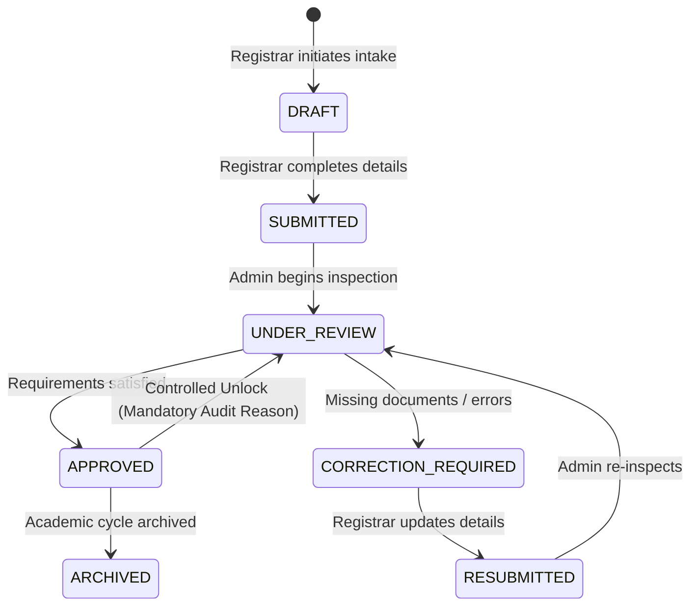

# ATA Digital Portal — Comprehensive System Architecture & Feature Reference

> **System Name:** Asia Theological Association (ATA) Student Registration & Institution Management Portal  
> **Framework & Stack:** Next.js (App Router), React 19, TypeScript, Tailwind CSS, Supabase (PostgreSQL & Storage), SheetJS (XLSX), Lucide React.  
> **Scope:** Full-fidelity summary of all application roles, routes, pages, features, workflows, and database entities.

---

## Table of Contents
1. [User Roles & Access Control Matrix](#1-user-roles--access-control-matrix)
2. [Application Routes & Navigation Map](#2-application-routes--navigation-map)
3. [Core Page Breakdowns](#3-core-page-breakdowns)
   - [3.1 Authentication (`/login`)](#31-authentication-login)
   - [3.2 Dashboard (`/dashboard`)](#32-dashboard-dashboard)
   - [3.3 Manage Register / Registrations Directory (`/registrations`)](#33-manage-register--registrations-directory-registrations)
   - [3.4 Student Directory & Lifetime History (`/students`)](#34-student-directory--lifetime-history-students)
   - [3.5 Institutions & Academic Structure (`/institutions`)](#35-institutions--academic-structure-institutions)
   - [3.6 Document Locker & Repository (`/documents`)](#36-document-locker--repository-documents)
   - [3.7 System Audit Logs (`/audit-logs`)](#37-system-audit-logs-audit-logs)
4. [Comprehensive Feature Catalog](#4-comprehensive-feature-catalog)
   - [4.1 Global Shell & Navigation System](#41-global-shell--navigation-system)
   - [4.2 New Registration Wizard (Global Modal & In-Page)](#42-new-registration-wizard-global-modal--in-page)
   - [4.3 Dynamic Student Search & Creation](#43-dynamic-student-search--creation)
   - [4.4 Bulk Excel Import Engine](#44-bulk-excel-import-engine)
   - [4.5 Registration Lifecycle & Review Dossier](#45-registration-lifecycle--review-dossier)
   - [4.6 In-Place Record Editing & Multi-Selection](#46-in-place-record-editing--multi-selection)
   - [4.7 Mobile & Web Camera Document Capture](#47-mobile--web-camera-document-capture)
   - [4.8 Correction Feedback & Revision Management](#48-correction-feedback--revision-management)
   - [4.9 Registrar Account Provisioning](#49-registrar-account-provisioning)
   - [4.10 Data Layer & Resilience Architecture](#410-data-layer--resilience-architecture-supabaseservice--mockfallback)
   - [4.11 UI/UX Component Foundation](#411-uiux-component-foundation)
5. [Workflow State Machine & Lifecycle Transitions](#5-workflow-state-machine--lifecycle-transitions)
6. [Database Schema & Data Models](#6-database-schema--data-models)

---

## 1. User Roles & Access Control Matrix

The portal enforces role-based access control (RBAC) across three distinct primary personas:

| Capability / Feature | `UNIVERSAL` (Super-Admin) | `ADMINISTRATOR` (Executive) | `REGISTRAR` (Operations) |
| :--- | :---: | :---: | :---: |
| **New Student Registration** | ✅ Yes | ❌ No | ✅ Yes (Primary Actor) |
| **Bulk Excel Student Roster Import** | ✅ Yes | ❌ No | ✅ Yes (Primary Actor) |
| **Manual Record Edit & Single/Bulk Delete** | ✅ Yes | ❌ No | ✅ Yes (Primary Actor) |
| **Camera Document Capture** | ✅ Yes | ❌ No | ✅ Yes (Primary Actor) |
| **Workflow Review & Status Transition** | ✅ Full Control | ✅ Full Control | ⚠️ Submit / Resubmit / Draft |
| **Controlled Unlock of Approved Records** | ✅ Yes (Mandatory Audit) | ✅ Yes (Mandatory Audit) | ❌ No |
| **Institutional & Degree Catalog Browsing** | ✅ Yes | ✅ Yes | ✅ Yes |
| **Student Lifetime History Timelines** | ✅ Yes | ✅ Yes | ✅ Yes |
| **Document Locker Upload & Preview** | ✅ Yes | ✅ Yes | ✅ Yes |
| **Manage & Provision Registrar Accounts** | ✅ Yes | ✅ Yes (Primary Actor) | ❌ No |
| **Full System Audit Trail & Governance Logs** | ✅ Yes | ✅ Yes | ❌ No |
| **Role Switcher in Header** | ✅ Yes | ✅ Yes | ✅ Yes (Demo Mode) |

### Role Definitions
- **`REGISTRAR`**: Operates on the front lines of student intake. Responsible for student record deduplication, entering personal details, selecting institutional departments/programs, capturing verification paperwork, initiating registrations, and resolving correction notes.
- **`ADMINISTRATOR`**: Oversees governance and quality assurance. Reviews submitted registrations, flags issues requiring correction, issues final approvals, monitors institutional metrics, and manages registrar accounts.
- **`UNIVERSAL`**: Highest-privilege superuser with complete operational autonomy. Can perform registrar tasks, administrative reviews, emergency unlocks with mandatory audit reasoning, and full audit inspection.

---

## 2. Application Routes & Navigation Map

| Route Path | Associated Component / File | Description & Supported URL Query Params |
| :--- | :--- | :--- |
| `/` | [`app/page.tsx`](file:///c:/Users/fanne/Desktop/ata-digital/app/page.tsx) | Automatic entry redirect to `/dashboard`. |
| `/login` | [`app/login/page.tsx`](file:///c:/Users/fanne/Desktop/ata-digital/app/login/page.tsx) | User authentication and interactive role simulation portal. |
| `/dashboard` | [`app/dashboard/page.tsx`](file:///c:/Users/fanne/Desktop/ata-digital/app/dashboard/page.tsx) | Executive and operational dashboards with real-time KPI metrics. • `?action=manage_registrars`: Opens registrar provisioning view. |
| `/registrations` | [`app/registrations/page.tsx`](file:///c:/Users/fanne/Desktop/ata-digital/app/registrations/page.tsx) | Central registration management hub (`Manage Register` for Registrars, `Registrations Directory` for others). • `?new=true`: Triggers New Registration modal. • `?id={regId}`: Opens detailed registration dossier. • `?query={text}`: Pre-populates search filter. |
| `/students` | [`app/students/page.tsx`](file:///c:/Users/fanne/Desktop/ata-digital/app/students/page.tsx) | Master directory of all student entities across institutions. • `?id={studentId}`: Displays Student Lifetime History Timeline. • `?query={text}`: Filters student search results. |
| `/institutions` | [`app/institutions/page.tsx`](file:///c:/Users/fanne/Desktop/ata-digital/app/institutions/page.tsx) | Accredited institution directory, department hierarchy, and degree level catalog. |
| `/documents` | [`app/documents/page.tsx`](file:///c:/Users/fanne/Desktop/ata-digital/app/documents/page.tsx) | Centralized document locker, general dossier attachments, and verification uploads. |
| `/audit-logs` | [`app/audit-logs/page.tsx`](file:///c:/Users/fanne/Desktop/ata-digital/app/audit-logs/page.tsx) | Immutable compliance audit logs tracking registrations, status updates, unlocks, and imports. |

---

## 3. Core Page Breakdowns

### 3.1 Authentication (`/login`)
- **Interactive Role Switcher**: Allows logging in directly as `REGISTRAR`, `ADMINISTRATOR`, or `UNIVERSAL`.
- **Form Validation**: Supports email/password input with mock credential autofill and session persistence via `AuthContext`.
- **Automatic Redirect**: Directs authenticated users to the primary dashboard.

### 3.2 Dashboard (`/dashboard`)
Dynamically renders a specialized dashboard tailored to the user's active role:
- **`RegistrarDashboard`**:
  - Top 4 KPI Metrics: Total Students, Total Registrations, Approved Registrations, Archived Registrations.
  - Action Queue / Task List: Highlights records in `DRAFT`, `CORRECTION_REQUIRED`, or pending review.
  - Interactive Distribution Visualizations: Workflow Status bar charts, Academic Year breakdown, Degree Level distribution, and Institutional hierarchy counter.
- **`AdministratorDashboard`**:
  - Review Queue: Highlights registrations awaiting administrative approval (`SUBMITTED`, `RESUBMITTED`).
  - Attention Required List: Displays records flagged with correction requests or overdue reviews.
  - Institutional Analytics: Program breakdowns and regional enrollment volume.
- **`UniversalDashboard`**:
  - Combines executive oversight with direct registrar execution widgets and system-wide governance stats.

### 3.3 Manage Register / Registrations Directory (`/registrations`)
- **Title Behavior**: Titled **"Manage Register"** for `REGISTRAR`, and **"Registrations Directory"** for other roles.
- **Header Actions**:
  - **Import Excel File**: Opens the bulk student import modal.
  - **Manual Registration**: Opens the 3-step New Registration Wizard modal.
- **Search & Multi-Filter Bar**:
  - Text search matching registration number, student full name, and institution.
  - Status dropdown filter (`ALL`, `DRAFT`, `SUBMITTED`, `UNDER_REVIEW`, `CORRECTION_REQUIRED`, `RESUBMITTED`, `APPROVED`, `ARCHIVED`).
  - "Select All" checkbox toggle with count.
- **Bulk Floating Action Bar**:
  - Automatically animates into view when one or more rows are checked.
  - Displays count of selected items with **Deselect All** and destructive **Delete Selected** triggers with confirmation modals.
- **Record Card Actions**:
  - **Capture**: Opens the live web/mobile camera stream for student document capture.
  - **Edit**: Opens the in-place student profile and registration parameters modal.
  - **Delete**: Prompts single-record deletion with cascading database cleanup.
  - **Details**: Navigates into the comprehensive registration lifecycle dossier.

### 3.4 Student Directory & Lifetime History (`/students`)
- **Global Student Roster**: Lists every individual enrolled across all accredited ATA institutions.
- **Search & Multi-Deletion**: Search by Permanent UID, First Name, Last Name, or Email with bulk selection and deletion support.
- **Student Lifetime History View (`StudentTimelineHistoryView`)**:
  - Triggered by clicking any student record or providing `?id={studentId}`.
  - Visual timeline showing every historical registration undertaken by the student across programs, departments, and academic years.
  - Direct **"Re-Register Student"** action that pre-populates the registration wizard with the candidate's existing Permanent UID and profile info.

### 3.5 Institutions & Academic Structure (`/institutions`)
- **Hierarchical Governance**: Displays 205 accredited ATA institutions, their constituent theological departments, and approved academic degree programs.
- **Interactive Degree Filter**: Filter degree offerings by academic tier (`ALL`, `DOCTORAL`, `MASTERS`, `BACHELORS`, `DIPLOMA_CERTIFICATE`).
- **Accredited Member Directory**: Expandable directory of all 202 accredited member seminaries and colleges with instant search, institutional codes, and geographical distribution.

### 3.6 Document Locker & Repository (`/documents`)
- **Document Management**: Central cloud storage for student affidavits, academic transcripts, identity verifications, and institution dossiers.
- **Live Upload Engine**: Drag-and-drop or file picker with automatic MIME-type detection, byte size calculation, and timestamping.
- **Storage Metrics**: Top metric counters showing total files, verified documents, and storage allocation.

### 3.7 System Audit Logs (`/audit-logs`)
- **Audit & Compliance Trail**: Tracks high-impact actions (`REGISTRATION_CREATED`, `STATUS_CHANGE`, `APPROVAL`, `CONTROLLED_UNLOCK`, `EXCEL_BATCH_IMPORT`, `DOCUMENT_CAPTURED`).
- **Detailed Metadata**: Captures actor name, actor role, timestamp, target entity ID, IP address, and change notes.
- **Filter & Search**: Search audit events by actor or entity, and filter by action type.

---

## 4. Comprehensive Feature Catalog

### 4.1 Global Shell & Navigation System
- **`PortalLayout`**: Master shell managing non-scrolling desktop sidebar, mobile responsive drawer with backdrop blur, global header, and global New Registration modal hosting.
- **`Sidebar`**:
  - Role badge indicator (`REGISTRAR`, `ADMINISTRATOR`, `UNIVERSAL`).
  - Primary CTA button: **`+ New Registration`** (available globally for `REGISTRAR` and `UNIVERSAL`).
  - Nav links with active route highlighting (Dashboard, Manage Register, Student Directory, Institutions, Document Locker, System Audit Logs).
  - Footer Support and Logout actions.
- **`Header`**:
  - Global omni-search input with debounced querying: searches across both students and registrations in parallel with direct dropdown navigation.
  - Interactive role switcher for rapid permissions preview.
  - Notification badge with preview popover.

### 4.2 New Registration Wizard (Global Modal & In-Page)
- Accessible from **any route** via the sidebar without losing page state or navigating away.
- **Step 1: Student Intake (Dynamic Search or Create)**:
  - **Pure Search-Driven**: Clean search input searching by Permanent UID, Name, or Email.
  - **Instant Progression**: Clicking any search result card immediately selects the student and advances to Step 2 without intermediate clutter.
  - **Create New Student**: Toggleable inline form with UID generation (`STU-2026-XXXXX`), Name, Email, Phone, DOB, Gender, State (mandatory), Street Address, City, District, PIN Code, Country, and Aadhar Number.
- **Step 2: Registration & Academic Placement**:
  - Displays selected/created student summary banner with "Change Student" action.
  - Registration Type selection buttons (`INITIAL_REGISTRATION`, `RE_REGISTRATION`, `TRANSFER`, `PROGRAM_PROGRESSION`).
  - **Academic Background & Qualification**:
    - Highest Qualification dropdown (19 canonical levels + "Other" write-in).
    - **Previous Institution / College**: Text input with embedded searchable `<datalist>` of all 202 accredited institutions plus custom entry.
    - **Previous Program / Course dropdown**: Contextually filtered program options across all 127 accredited degree and diploma titles + "Other" write-in.
    - Year of Completion & Qualification Roll Number.
    - Conditional Previous Registration Number for non-initial registrations.
  - **Current Program Registration & Institutional Placement**:
    - **Institution Dropdown**: Populated with all 205 accredited seminaries and institutions.
    - **Department Dropdown**: Dynamically cascades with "All Departments" option for multi-department seminaries.
    - **Program Dropdown**: Displays authoritative courses & degrees for the selected institution with automatic department synchronization.
    - Academic Year selector (`2026-2027`, etc.).
    - Registrar intake notes field.
- **Step 3: Review & Submit**:
  - Comprehensive registration preview summarizing student identity, academic background, institutional placement, and deterministic Registration ID preview (`[INST]/[PROG]/[YEAR]/[SEQ]`).
  - **Save as Draft** (sets status to `DRAFT`).
  - **Submit Registration** (sets status to `SUBMITTED`).

### 4.3 Dynamic Student Search & Creation
- Deduplication by email and Permanent UID.
- Instant fallback prompt with one-click creation trigger when no search matches exist.

### 4.4 Bulk Excel Import Engine (`ExcelImportModal`)
- **Spreadsheet Parsing via SheetJS**: Accepts `.xlsx` and `.xls` files.
- **Flexible Header Mapping**: Automatically matches column variations (e.g., `First Name`, `firstName`, `permanent_uid`, `Student UID`, `Email`, `Program`, `Institution`).
- **Duplicate Detection**: Queries existing database records in real time and flags duplicate UIDs/emails before committing.
- **Downloadable Sample Template**: Generates and downloads a clean, pre-formatted `.xlsx` template populated with example student records and accredited institutions.
- **Batch Processing**: Inserts students and corresponding registrations in batch transactions.

### 4.5 Registration Lifecycle & Review Dossier (`RegistrationDetailView`)
- Full student and institutional profile inspection.
- **Workflow State Management**:
  - `DRAFT` ➔ `SUBMITTED`
  - `SUBMITTED` ➔ `UNDER_REVIEW` ➔ `APPROVED` or `CORRECTION_REQUIRED`
  - `CORRECTION_REQUIRED` ➔ `RESUBMITTED` ➔ `APPROVED`
- **Audit Log Timeline**: Shows chronological history of all status changes, review timestamps, and notes.
- **Controlled Record Unlock**: Allows administrators to unlock an already `APPROVED` record back to `UNDER_REVIEW`, enforcing a mandatory, audited reason note.

### 4.6 In-Place Record Editing & Multi-Selection
- **`EditRegistrationModal`**: Edit candidate first/last name, email, phone, academic year, registration classification, workflow status, and internal notes in place without leaving the list.
- **Multi-Selection Actions**: Select multiple candidate records to delete in bulk with automated student table synchronization.

### 4.7 Mobile & Web Camera Document Capture (`MobileWebCameraCapture`)
- **Webcam Integration**: Direct browser camera access to capture physical verification documents and photo IDs.
- **Live Mobile Camera Stream**: Generates a simulated mobile live-capture pairing session for scanning physical documents using a mobile phone.
- **Attachment Gallery**: Previews captured documents with download and removal capabilities.

### 4.8 Correction Feedback & Revision Management (`CorrectionModal`)
- Triggered by reviewers when a registration has missing documentation or invalid information.
- Provides predefined reason codes (e.g., *Incomplete Prior Academic Transcripts*, *Missing Church Endorsement*, *ID Verification Unclear*).
- Allows custom correction instructions delivered directly to the candidate/registrar.

### 4.9 Registrar Account Provisioning (`ManageRegistrarsView` & `CreateRegistrarModal`)
- Allows Administrators and Universal users to manage operational registrar accounts.
- Create new registrars with name, email, assigned institution, and auto-generated secure temporary passwords.
- Real-time registrar directory with account activation and revocation controls.

### 4.10 Data Layer & Resilience Architecture (`SupabaseService` & `MockFallback`)
- **Dual-Engine Persistence**: The platform utilizes an enterprise service layer pattern (`lib/api/supabase-service.ts`) coupled with a comprehensive fallback engine (`lib/api/mock-fallback.ts`).
- **Zero-Config Developer Fallback**: If Supabase credentials (`NEXT_PUBLIC_SUPABASE_URL` or `NEXT_PUBLIC_SUPABASE_ANON_KEY`) are missing, invalid, or offline, the application seamlessly and transparently routes all queries, mutations, and searches to an in-memory data store without UI disruptions or crashes.
- **Real Database Synchrony**: When connected to Supabase, all relational queries execute against PostgreSQL with foreign key cascades, row-level security (RLS), and file storage buckets.

### 4.11 UI/UX Component Foundation
- **`StatusBadge`**: Standardized color-coded status badges with contextual dot indicators and human-friendly labels for all 7 workflow states.
- **`MetricCard`**: Trend-aware statistic cards displaying numeric counts, percentage differentials, and Lucide icons.
- **Distribution Visualizations**:
  - `WorkflowDistribution`: Interactive multi-state progress bar and percentage breakdowns.
  - `AcademicYearDistribution`: Session-by-session student volume analyzer.
  - `RegistrationTypeDistribution`: Intake distribution across initial vs. transfer vs. re-registration cohorts.
  - `InstitutionDistribution` & `OrgHierarchyDistribution`: Comparative enrollment metrics across member seminaries.
- **`EmptyState` & `ErrorAlert`**: Clean, accessible empty states with contextual illustrations, call-to-actions, and error recovery boundaries.
- **`LoadingSkeleton`**: Smooth shimmer loaders preventing layout shift during asynchronous data fetching.

---

## 5. Workflow State Machine & Lifecycle Transitions

---

## 6. Database Schema & Data Models

### 1. `students` Table
| Column | Type | Constraints | Description |
| :--- | :--- | :--- | :--- |
| `id` | `UUID` | PK, default `gen_random_uuid()` | Unique internal student ID |
| `permanent_uid` | `TEXT` | UNIQUE, NOT NULL | Standardized Permanent Student UID (e.g., `STU-2026-XXXXX`) |
| `first_name` | `TEXT` | NOT NULL | Candidate given name |
| `last_name` | `TEXT` | NOT NULL | Candidate surname |
| `email` | `TEXT` | UNIQUE, NOT NULL | Primary contact email |
| `phone` | `TEXT` | NULLABLE | Phone contact |
| `date_of_birth` | `DATE` | NULLABLE | Date of birth |
| `gender` | `TEXT` | NULLABLE | Candidate gender (`Male`, `Female`, `Other`) |
| `national_id` | `TEXT` | NULLABLE | Government or national ID reference / Aadhar number |
| `state` | `TEXT` | NULLABLE (Enforced for new registrations) | Candidate state of residence |
| `address` | `TEXT` | NULLABLE (Enforced for new registrations) | Street / postal address |
| `city` | `TEXT` | NULLABLE (Enforced for new registrations) | City / town |
| `district` | `TEXT` | NULLABLE | District |
| `pincode` | `TEXT` | NULLABLE (Enforced for new registrations) | PIN / postal code |
| `country` | `TEXT` | NULLABLE (Enforced for new registrations) | Country (default: India) |
| `alternate_phone` | `TEXT` | NULLABLE | Secondary contact phone |
| `alternate_email` | `TEXT` | NULLABLE | Secondary contact email |
| `student_photo` | `TEXT` | NULLABLE | Student profile photo URL |
| `created_at` | `TIMESTAMPTZ` | default `now()` | Timestamp of record creation |

### 2. `registrations` Table
| Column | Type | Constraints | Description |
| :--- | :--- | :--- | :--- |
| `id` | `UUID` | PK, default `gen_random_uuid()` | Unique registration ID |
| `registration_number`| `TEXT` | UNIQUE, NOT NULL | Authoritative registration ID (e.g., `[INSTITUTION_CODE]/[PROGRAM_CODE]/[YEAR]/[SEQUENCE]`, like `SABC/BTH/2026/1`) |
| `student_id` | `UUID` | FK ➔ `students.id` (CASCADE) | Associated student |
| `registration_type` | `TEXT` | NOT NULL | `INITIAL_REGISTRATION`, `RE_REGISTRATION`, `TRANSFER`, `PROGRAM_PROGRESSION` |
| `institution_id` | `UUID` | FK ➔ `institutions.id` | Associated theological institution |
| `department_id` | `UUID` | FK ➔ `departments.id` | Academic department |
| `program_id` | `UUID` | FK ➔ `programs.id` | Enrolled degree program |
| `academic_year` | `TEXT` | NOT NULL | Academic enrollment session (e.g., `2026-2027`) |
| `status` | `TEXT` | NOT NULL | `DRAFT`, `SUBMITTED`, `UNDER_REVIEW`, `CORRECTION_REQUIRED`, `RESUBMITTED`, `APPROVED`, `ARCHIVED` |
| `notes` | `TEXT` | NULLABLE | Registrar or reviewer notes |
| `rejection_reason` | `TEXT` | NULLABLE | Correction or rejection notes |
| `highest_qualification` | `TEXT` | NULLABLE | Highest completed qualification level |
| `previous_institution` | `TEXT` | NULLABLE | Name of previous academic institution |
| `previous_program` | `TEXT` | NULLABLE | Specific course or degree program previously completed |
| `year_of_completion` | `TEXT` | NULLABLE | Year of completion for previous qualification |
| `qualification_reg_no` | `TEXT` | NULLABLE | Previous qualification registration/roll number |
| `previous_registration_number` | `TEXT` | NULLABLE | Authoritative ATA registration number for transfers/re-registrations |
| `submitted_at` | `TIMESTAMPTZ` | NULLABLE | Timestamp of submission |
| `reviewed_at` | `TIMESTAMPTZ` | NULLABLE | Timestamp of admin review |
| `created_at` | `TIMESTAMPTZ` | default `now()` | Record creation timestamp |

### 3. `institutions`, `departments`, and `programs` Tables
- `institutions` (205 total): `id`, `name`, `code` (e.g., `NIBS`, `SAIACS`, `MTSC`, `CLGD`, `AGST-NEI`, `IBTS`, `UBS`, `CI`, `NTC`, `NLC`, `HBIC`, `ETS`, `IPC-TS`, `COTR-TS`, `FIGS`, `AGAPE`, `MAGBC`, `HBC`, `MTTC`, `GBC`, `NBC`, `DTC`, `NEST`, `JLI`, `VTS`, `LTCI`, `RTC`, `SIBBC`, `ATA`, `ABS`, `DBC`, etc.), `created_at`.
- `departments` (232 total): `id`, `institution_id` (FK), `name`, `code` (e.g., `THEO`, `MIN`, `ACAD`, `ONLINE`), `created_at`.
- `programs` (1000+ total across departments and degree levels): `id`, `department_id` (FK), `name`, `code` (e.g., `BTH`, `MDIV`, `MTH-PTC`, `DMIN-OL`, `PHD`, `IMTH`, `MATS-A-OL`), `degree_level` (`BACHELORS`, `MASTERS`, `DOCTORAL`, `DIPLOMA`), `created_at`.

### 4. `documents` & `audit_logs` Tables
- `documents`: `id`, `name`, `type`, `size`, `url`, `entity_type`, `entity_id`, `created_at`.
- `audit_logs`: `id`, `action`, `actor_name`, `actor_role`, `entity_type`, `entity_id`, `details`, `ip_address`, `created_at`.

